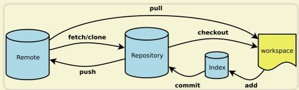
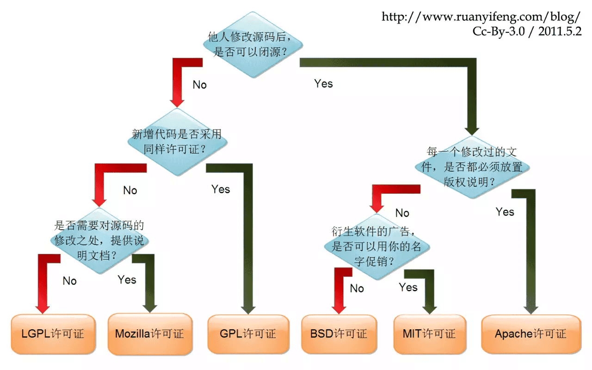

## 基本常用命令

> 第一次使用 git 的时候，需要设置用户信息和用户邮箱，用于辨识提交者身份。

```bash
git config --global user.name <git用户名>
git config --global user.email <邮箱地址>
git config --list                           # 查看当前用户信息
git config --global --list                  # 查看全局配置
git config --local --list                   # 查看本项目配置

git config --global alias.cm commit
git config --global alias.br branch                   # 配置指令别名简写

git config --global credential.helper store           # 输入一次账号密码后第二次就会记住账号密码

git config --global core.ignorecase false             # 关闭忽略大小写

git config --system core.longpaths true               # 配置长路径

git config --global http.sslVerify false              # 禁用 SSL 验证

git config --global core.protectNTFS false            # 关闭 NTFS 文件保护

git config --global url."https://".insteadOf git://   # git:// 报错
```

## 基本操作

```bash
git init                    # 把当前的目录变成可以用 git 进行版本控制的 git 仓库，生成隐藏 .git 文件。
git clone <repository-url>  # 从远程库中克隆到本地
git status                  # 查看所有文件状态 加参数 `-s` 显示已修改的
git add xxx                 # 把 xxx 文件添加到暂存区去。
git add –A                  # git add --all的缩写，添加全部到暂存区
git add –u                  # 把文件的删除和修改添加到暂存区（不包括新增）
git add .                   # 监控工作区的状态树，使用它会把工作时的所有变化提交到暂存区
git commit -m "message"     # 从暂存区提交到本地仓库
git commit -a -m "message"  # 相当于省略 git add，但是无法提交新增的文件
git push origin master      # Git 会把 master 分支推送到远程库对应的远程分支上
git clean                   # 删除非管理对象的文件
```

> "commit message" 内容尽量规范！

* 当某一次提交后，突然想起漏提交了文件，或不小心提交了不满意的代码时，可以使用 `git commit --amend -m "message"` 指令。它可以在不增加一个新的 `commit-id` 的情况下将新修改的代码追加到前一次的 `commit-id` 中。提交之后 message 也将被本次的 message 覆盖，所以还需要再次添加上次的 message。

> Tips: commit 时加上 `--no-verify` 可以跳过 eslint 等 hooks 校验

## push

```bash
git push origin name
git push –u origin master
git push origin --delete name     # 删除远程分支
```

> 把当前 master分支推送到远程库; `-u` 表示记住分支和地址，下次使用 `git push` 即可。

## remote

```bash
git remote add origin <repository-url> # 关联一个远程库 仓库名叫 origin
git remote                             # 查看远程库的信息
git remote –v                          # 查看远程库的详细信息
```

## clone

```bash
git clone <repository-url>                   # 从远程库中克隆
git clone -b branchName <repository-url>     # 克隆指定分支
```

## pull

```bash
git pull
```

> 从远程仓库拉下来到本地库然后合并相当于 `git fetch` + `git merge`，`pull` 时，**Git 默认会把合并也提交到远端，需设置关闭**。

* 一般 `push` 前先拉去最新版本，避免代码冲突，如果有冲突需要解决了冲突才能提交。

## fetch

```bash
git fetch               # 从远程库抓下最新版本，但是不合并。
```

> fetch 是从远程库到本地库，但是未在工作区，需要 `git merge`。

## merge

```bash
git merge dev           # 在当前的分支上合并dev分支
```

> 分支合并也是在本地完成，新的分支只有在合并后才允许被删除。

* 如果分支合并是出现冲突需要解决了冲突才能合并，使用 `git status` 查看冲突文件。

## branch/checkout

```bash
git branch                     # 查看当前所有的分支，前面有 "*" 的为目前所在的分支。
git branch name                # 创建分支
git branch –r                  # 看远程所有分支
git branch –a                  # 查看本地远程分支
git branch –d name             # 删除分支
git push origin --delete name  # 删除远程分支
git checkout name              # 切换分支
git checkout –b name           # 创建并切换到 name 分支上
git clone -b name url          # 克隆指定分支代码文件
git push name                  # 提交到指定分支

# 合并分支（主分支操作）
git checkout master
git merge <commit> or <branch_name>
git push
```

!> `git checkout -- file` 相当于取消对文档的修改，将最新的本地版本库的本文件复制覆盖它，比较危险！

## reflog/log

```bash
git log               # 显示所有提交过的版本信息：commit id，提交者，日期（完成后按 Q 键退出）。
git reflog            # 查看历史记录的 commit id
```

?> 想看到自己的操作记录，则可以使用 `log` 与 `reflog`，它两个的区别如下。

1. `git log` 命令可以显示所有提交过的版本信息。
    * 如果感觉太繁琐，可以加上参数 `--pretty=oneline`，只会显示版本号和提交时的备注信息。
2. `git reflog` 可以查看所有分支的所有操作记录，包括已经被删除的 commit 记录和 reset 的操作。
    * 常用语错误/危险操作恢复、回退。

## reset

```bash
git reset --hard HEAD^        
git reset --hard HEAD~        # 回退到上一个版本
git reset HEAD^        
git reset HEAD~               # 回退到上一个版本
git reset --hard HEAD~100     # 回退到 100 个版本

git reset head -- file        # 不加 file 则全部退回  
git reset file                # 将本地仓库的当前版本退回至暂存区，相当于取消暂存。
```

* 版本回退的操作一般是先查看历史提交版本的 commit id，使用 `git reflog`。
* 接着使用命令 `git reset --hard commit_id` 回退版本
* 最后 `git push -f （origin master可写可不写）` 提交远程库，前提非 `protect` 分支。
* 版本退回是从本地仓库到暂存区，如果已经提交远程库，此时的版本是低于最新的版本的会拒绝提交，
* 所以需要用 `git push -f origin master` 强制提交。

## status

```bash
git status
```

> 查看你的文件在暂存区和工作目录的状态，默认是较为详细的显示，并提示你可以用何种命令完成你接下来可能要做的事情。

```bash
git status -s
```

* 较为简单的输出当前的状态，如：

```bash
$ git status -s
M  README.md
 D hello.rb
?? world.java
```

> 你可以看到，在简短输出中，有两栏。第一栏是暂存区的，第二栏则是工作目录的。这里表示：

* `README.md` 在暂存区中的状态是 `modify`
* `hello.rd` 在工作目录中的状态是 `delete`
* `world.java` 还未添加到版本控制。

## diff

```bash
git diff xxx        # 查看 xxx 文件修改了哪些内容

git diff            # 工作目录和暂存区
git diff --cached   # 暂存区和本地仓库
git diff HEAD       # 工作目录和本地仓库
git diff --stat     # 显示信息摘要
```

## rm/mv

```bash
git rm                            # 将文件从暂存区和工作目录删除，-f 为强制删除
git rm filename                   # 删除文件
git rm –r dirname                 # 删除文件夹 –r 表示递归所有子目录
git rm --cached <path>            # 将文件从暂存区中删除
git mv <old_path> <new_path>
```

> `git rm` 用来删除文件、目录。`git mv` 命令用于移动或重命名一个文件、目录。

* 比如删除 `photos` 文件，本地删除后，远程仓库还会有，所以执行如下操作：

```bash
git rm -r photos
git commit -m "删除相册"
git push
```

## submodule

### 添加子模组

```bash
git submodule add <url>       # 添加子模组
git submodule init            # 子模组初始化
git submodule update          # 子模组更新
git submodule update --remote # 子模组更新后父模组也要更新

# 当需要用到别人的项目代码时，可以在自己的仓库添加子模组。
git submodule add <url>         # 添加子模组
git submodule init              # 初始化子模组/刷新
git commit -m "备注"            # 提交变动到本地库
git push origin master         # 将本地库同步到远程库
```

### 修改/删除子模组

* 如果远程库子模组有更新，你要更新本地库子模组应该在 git pull 之后运行。

```bash
git submodule update
```

> 如果要更新子模组，子模组和父版本库要分别提交，注意：子模组进行更新后，父版本库需要添加这个更新再推送，即 git add。

```bash
# 删除子模组 手动删除 然后修改 config 文件
# 命令删除
git rm --cached  # 子模块目录 删除子模块缓存

rm -rf 子模块目录 # 删除子模块目录

vim .gitmodules  # 删除对于子模块相关条目

vim .git/config  # 删除配置项中子模块相关条目

# 修改子模组（本地）
# 修改后
git submodule add 相对路径       # 添加子模组
git submodule init              # 初始化子模组/刷新
git commit -m "备注"            # 提交变动到本地库
git push origin master         # 将本地库同步到远程库
# 然后父模组
git status
git add . or -A
git commit -m "修改子模组"
git push origin master
```

* 当一个远程库有子模组时，直接 clone 子模组只是一个空文件夹，需要进入子模组的空文件夹 `init` 和 `update` 才行。
* 或者使用递归克隆 `git clone --recursive 远程库`
* 子模组更新后，父模组必须更新，因为需要更新 commit id。

## tag

### 基本命令

```bash
git tag -a v1.0                   # 给最新一次提交打标签
git tag -a <tagname> -m '标签'    # 指定标签信息命令
git tag                           # 查看版本打的 Tag，显示的标签按字母顺序排列，所以标签的先后并不表示重要程度的轻重。
git tag tagname                   # 给本次提交添加标签
git push --tag                    # 推送本地标签到远程
git push origin –tags or tagname  # –tags 所有标签，tagname 单个标签。
git tag -d tagname                # 删除本地标签
git push --delete origin tagname  # 删除远程标签
```

> 我们可以用特定的搜索模式列出符合条件的标签。在 Git 自身项目仓库中，有着超过 240 个标签，如果你只对 1.3 系列的版本感兴趣，可以运行下面的命令：

```bash
git tag -l 'v1.3.*'
# 结果全为 v1.3 开头的标签
v1.3.1
v1.3.2
v1.3.3
v1.3.4
```

* 当你执行`git tag -a`命令时，Git会打开你的编辑器，让你写一句标签注解，就像你给提交写注解一样。
* 如果我们忘了给某个提交打标签，又将它发布了，我们可以给它追加标签。
* 例如，假设我们发布了提交 `85fc7e7(最后一行)`，但是那时候忘了给它打标签。 我们现在也可以。

```bash
$ git tag -a v0.9 85fc7e7
$ git log --oneline --decorate --graph
*   d5e9fc2 (HEAD -> master) Merge branch 'change_site'
|\  
| * 7774248 (change_site) changed the runoob.php
* | c68142b 修改代码
|/  
* c1501a2 removed test.txt、add runoob.php
* 3e92c19 add test.txt
* 3b58100 (tag: v0.9) 第一次版本提交

git show
# 可以使用 git show 命令查看相应标签的版本信息，并连同显示打标签时的提交对象。
```

### 同步远程-本地Tag

```bash
git tag | xargs git tag -d
git fetch --tags
```

### 推送标签

> 默认情况下，git push 并不会把标签传送到远端服务器上，只有通过显式命令才能分享标签到远端仓库。其命令格式如同推送分支，运行 `git push origin [tagname]` 即可。

* 如果要一次推送所有本地新增的标签上去，可以使用 `--tags` 选项；然后，其他人克隆共享仓库或拉取数据同步后，也会看到这些标签。

## stash

```
git stash               # 把当前的工作隐藏起来，等以后恢复现场后继续工作。
git stash list          # 查看所有被隐藏的文件列表
git stash clear         # 清空当前仓库所有 stash

# 暂存当前工作进度
git stash
 
# 列出所有stash项
git stash list
# 会显示
# stash@{0}: WIP on branch: 1234567 Some work
# stash@{1}: WIP on branch: 89abcd7 Other work
# stash@{2}: WIP on branch: fedcba9 More work
 
# 应用最新的stash项
git stash apply
 
# 应用指定的stash项，例如stash@{2}
git stash apply stash@{2}
 
# 删除最新的stash项
git stash drop
 
# 删除指定的stash项，例如stash@{2}
git stash drop stash@{2}
 
# 应用最新的stash项，并在应用后删除它
git stash pop
 
# 清除所有stash项
git stash clear
```

## gitk

```bash
gitk                    # git 自带 GUI
gitk --all
```

## 其他

* [Learn Git Branching](https://learngitbranching.js.org/)

* 特殊问题处理

---

?> 在克隆远程库曾出现问题：没有弹出输入框验证框，直接就提示认证失败。

解决办法：使用 Git 输入下面两条命令（需要管理员权限）

```bash
git credential-manager uninstall         # 清除缓存账号密码（卸载）
git credential-manager install           # 安装资格证书
```

?> 在提交上传远程库曾出现问题：git push 提交到远程仓库时，git 会卡住等半天都没反应，只能按 Ctrl+C 退出。

解决办法：使用 Git 输入以下面的命令

```bash
git config --global sendpack.sideband false      # 配置文件添加属性
```

输入下面的命令可以查看仓库配置，看到 sendpack.sideband 等于 false 就可以重新 push 了。

```bash
git config --local -l  # 查看配置信息
```

---

## 托管网站

?> 托管网站解释

* 一个组织可以有 0-N 个用户，一个用户默认为一个组织，可以加入多个组织。一个组织有 0-N 个仓库，一个仓库中有 0-N 个代码文件。
* 工单可以反馈问题情况等，里程碑是开发者建立（要在某个时间之前完成什么功能）。
* 提交(Commit)可以与工单关联，工单(Issue)可以与里程碑关联。
* 版本发布是发布重要的版本
* 百科是开发者编写关于这个项目的一些内容
* 动态可以看到仓库的变动信息
* fork 相当于克隆仓库 后续不会改变。镜像仓库可以随父仓库更新，主要用于国外网站，创建一个国内的镜像来加快响应速度。

?> 托管网站/平台 issue 相关常见标签

* `bug` 描述的问题是一个 bug
* `enhancement` 功能增强，没有 feature 也可以指 New feature or request。
* `feature` 新功能
* `duplicate` 问题重复
* `invalid` 可用的，不是 bug。
* `question` 疑问，需要进一步的信息。
* `wontfix` 不会修复此问题
* `help-wanted` 需要帮助
* `good first issue` Good for newcomers

?> 托管网站/平台 issue 相关内部流程-理想化

* 收到产品需求后建立 issue
* 管理员评估 issue 并分配标签，指派负责人。
* 负责人检查已指派的 issue，选择项目发布 tag 以及建立里程碑(Milestone)。
* 负责人开发并推送代码，commit 信息开头或末尾附带 issue 编号，比如：`Feat: [#1] 提交代码信息` / `Feat: 提交代码信息 [#1]`。
* 也可以后续对接其他平台，使用托管网站 api 即可。
* 这样就可以通过一个平台了解工作进度与开发发布任务

?> License



## 教学推荐

* [Gitee 教程](https://gitee.com/all-about-git)
